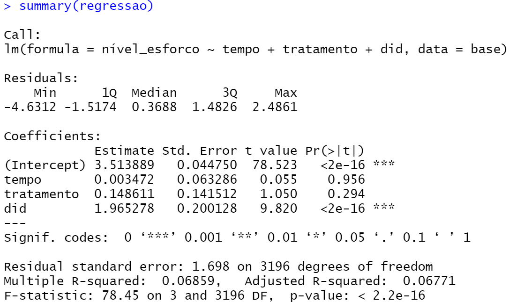

""""""""""""""""""""""""""""""""
Indicador de Esforço Docente
""""""""""""""""""""""""""""""""

======================
Entendendo o Indicador
======================

O esforço realizado pelos professores no exercício da profissão é um aspecto que não se pode consultar ou medir diretamente. No entanto, o INEP apura um indicador de esforço docente que atuam no Ensino Fundamental e Ensino Médio.

Conforme o citado instituto, o indicador classifica o docente em níveis de 1 a 6 de acordo com o esforço empreendido no exercício da profissão, níveis elevados indicam maior esforço. A partir dos dados disponíveis no Censo da Educação Básica, considerou-se que o esforço docente está relacionado às seguintes características da docência: número de escolas em que atua, número de turnos de trabalho, número de alunos atendidos e número de etapas nas quais leciona. 

Com base nisso, construímos uma base de dados simulada (base_1), cujo link segue ao final do texto, constituída por 800 docentes, sendo 80 do grupo de tratamento, entre os anos de 2016 e 2019. Na simulação, os anos 2016 e 2017 foram considerados como anteriores à política pública e os anos 2018 e 2019 como posteriores. 

A primeira coluna da base representa o professor (para cada qual foi atribuído um número de 1 a 800) e a segunda coluna é o nível de esforço apurado conforme o indicador do INEP. Já a coluna tratamento registra “sim” para o professor que tenha sido alvo da política pública, ou seja, que tenha recebido o apoio à participação em eventos de natureza científica, tecnológica e de inovação. Por fim, a última coluna registra o ano correspondente ao dado.

Sob o ponto de vista econométrico, o modelo diff-in-diff é o seguinte:

esforço docente = α + β1 · grupo_tratado i · pós_tratamento t + β2 · grupo_tratado i + β3 · pós_tratamento i + ε i

Link base_1: https://drive.google.com/file/d/1piYyjuJbAj9cuayDk2H34MjEOpJFovuy/view?usp=sharing
  
========================
Calculando o modelo no R
========================

Inicialmente, precisamos informar ao R a localização da sua base de dados. A função “setwd” significa set working directory ou definir diretório de trabalho.O argumento dessa função deverá ser o local da pasta. Por exemplo, caso sua base de dados esteja localizada na pasta “C:/Users/Base/base_1”:

.. code-block:: r

    setwd("C:\\Users\\Base\\base_1")

Observe que deve ser utilizado dupla barra invertida em todos sistemas operacionais Windows.

O próximo passo é abrir a base de dados. Cada formato de arquivo(“xlsx”, “csv”, “xml”) possui uma forma distinta de abrir. Nesse guia o formato utilizado será “xlsx”, do aplicativo Excel da Microsoft.

1. Caso não possua, instale um pacote que permita abrir arquivos “xlsx”:

.. code-block:: r

	install.packages("openxlsx")

2. Carregue o pacote:

.. code-block:: r
	
	library("openxlsx")

3. Obtenha o nome do arquivo em que está contida sua base de dados. Se sua base de dados for o arquivo “Base_FAP.xlsx”, então passe o nome do arquivo após “xlsxFile” sem aspas e sem o formato “.xlsx”:

.. code-block:: r

	base = openxlsx::read.xlsx(xlsxFile = base_1)

Observe que, no canto superior direito, o campo “Environment” possui uma nova variável: “base_1”. Essa variável contêm a sua base de dados e com ela que o R irá interagir.

================================
Definindo o início do Tratamento
================================

Precisamos definir quando o nosso evento em questão começou. Conforme já citado, anos 2016 e 2017 foram considerados como anteriores à política pública e os anos 2018 e 2019 como posteriores, então:

.. code-block:: r

	base_1$tempo = ifelse(base_1$ano >= 2018, 1, 0)

========================================
Definindo Grupo de Tratamento e Controle
========================================

Numa regressão por diferenças existem 2 grupos distintos: os que receberam o tratamento e o grupo de controle. A coluna “tratamento” da base_1 registra “sim” para o professor que tenha sido alvo da política pública, ou seja, que tenha recebido o apoio à participação em eventos de natureza científica, tecnológica e de inovação e, caso contrário, registra “não”.

.. code-block:: r

	base_1$tratamento = ifelse(base_1$tratamento == "sim", 1, 0)

Desse modo, foi criada a coluna “tratamento”, que assume os valores:
• 1 para as observações que foram tratadas;
• 0 para as observações do grupo de controle.

===========================================
Criando a variável Diferenças-em-Diferenças
===========================================

A variável do modelo de regressão de diferenças-em-diferenças é uma interação entre as nossas colunas “tempo” e “tratados”. Para este guia, basta saber que essa interação irá criar uma variável, que chamaremos “did”, que representará o efeito do tratamento.

.. code-block:: r

	base_1$did = base_1$tempo * base_1$tratamento

======================
Realizando a Regressão
======================

Finalmente, tudo está pronto para realizar a regressão. Tendo o modelo econométrico em mãos, o R possui a função “lm” para realizar regressões. Os argumentos essenciais para essa função:
• “fórmula” cujo formato é variável dependente ~ variáveis independentes. Os nomes das variáveis são as colunas que as respectivas se encontram;
• “data” que deve ser preenchida com sua base de dados.

O comando no nosso exemplo é:

.. code-block:: r

	regressao = lm(nível_esforco ~ tempo + tratamento + did, data = base_1)

===========================
Interpretando os resultados
===========================

Para ter acesso aos resultados da regressão, utilizamos a função summary:

-------------------------
Nível de significância
-------------------------

O nível de significância irá dizer a probabilidade de que nossos resultados encontrados coincidam com a realidade. Uma forma de mensurar essa probabilidade é através do p-valor, última coluna da regressão Pr(>|t|). Quanto menor o p-valor, maior será a probabilidade de os resultados condizerem com a realidade. No geral, pode se dividir da seguinte forma:

--------------------------------------------
P-valor / Interpretação / Indicação do R
--------------------------------------------

Maior que 0,05 / Não significante                  

0,01 a 0,05 / Significante / *

0,001 a 0,01 / Muito significante / **

Menor que 0,001 / Extremamente significante / ***

Portanto, avaliando o p-valor da variável did, podemos classificá-la como extremamente significante. O próprio software R nos auxilia com essa classificação, bastando observar o número de asteriscos. Então, nesse caso, é possível evidenciar que houve impactos do apoio previsto no Edital nº 10/2019 no esforço docente.

------------------
Sinal da variável
------------------

Na coluna Estimate estão os estimadores para cada variável do modelo, as quais, no caso, assumem os sinais positivos. Isso quer dizer que a política teve efeitos positivos na variável estudada, ou seja, o apoio previsto no Edital nº 10/2019 contribui positivamente para um aumento no esforço docente.

---------------------
Mensurando o impacto
---------------------

Na coluna Estimate estão os estimadores para cada variável do modelo. A interpretação do impacto da política pode ser realizada por meio da variável did da seguinte maneira: o fato de o docente ter sido contemplado com o apoio à participação em eventos de natureza científica, tecnológica e de inovação eleva indicador de esforço docente em 1,965278.

.. raw:: html

   

    <iframe width="560" height="315" src="https://www.youtube.com/embed/A5VIBhddm84" frameborder="0" allow="accelerometer; autoplay; encrypted-media; gyroscope; picture-in-picture" allowfullscreen></iframe>
   

