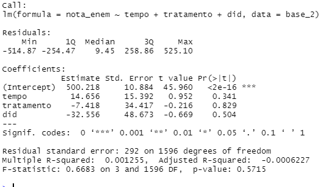

""""""""""""""""""""""
Indicador Nota do Enem
""""""""""""""""""""""

A nota do Exame Nacional do Ensino Médio (Enem) do aluno é uma variável que pode ser medida diretamente de forma objetiva e constitui um bom parâmetro para avaliação do impacto de políticas na educação.

Em nossa simulação, a nota varia de 0 a 1000. Com base nisso, construímos uma base de dados simulada (base_2), cujo link segue ao final do texto, constituída por 800 alunos, sendo 80 do grupo de tratamento, entre os anos de 2018 e 2019. Na simulação, o ano 2018 foi considerado como anterior à política pública e o ano de 2019 como posterior. 

A primeira coluna da base representa o aluno (para cada qual foi atribuído um número de 1 a 800) e a segunda coluna é a nota obtida no Enem. Já a coluna tratamento registra “sim” para o aluno que tenha sido alvo da política pública, ou seja, que tenha recebido o apoio à participação em eventos de natureza científica, tecnológica e de inovação. Por fim, a última coluna registra o ano correspondente ao dado.
Sob o ponto de vista econométrico, o modelo diff-in-diff é o seguinte:

esforço docente = α + β1 · grupo_tratado i · pós_tratamento t + β2 · grupo_tratado i + β3 · pós_tratamento i + ε i

Link base_2: https://drive.google.com/file/d/1mmDW8eV21lOfeezXghK-sRkLw3xYK6Iv/view?usp=sharing

========================
Calculando o modelo no R
========================

Inicialmente, precisamos informar ao R a localização da sua base de dados. A função “setwd” significa set working directory ou definir diretório de trabalho.O argumento dessa função deverá ser o local da pasta. Por exemplo, caso sua base de dados esteja localizada na pasta “C:/Users/Base/base_2”:

.. code-block:: r

	setwd("C:\\Users\\Base\\base_2")

Observe que deve ser utilizado dupla barra invertida em todos sistemas operacionais Windows.

O próximo passo é abrir a base de dados. Cada formato de arquivo(“xlsx”, “csv”, “xml”) possui uma forma distinta de abrir. Nesse guia o formato utilizado será “xlsx”, do aplicativo Excel da Microsoft.

1. Caso não possua, instale um pacote que permita abrir arquivos “xlsx”:

.. code-block:: r
	
	install.packages("openxlsx")

2. Carregue o pacote:

.. code-block:: r

	library("openxlsx")

3. Obtenha o nome do arquivo em que está contida sua base de dados. Se sua base de dados for o arquivo “Base_FAP.xlsx”, então passe o nome do arquivo após “xlsxFile” sem aspas e sem o formato “.xlsx”:

.. code-block:: r

	base = openxlsx::read.xlsx(xlsxFile = base_2)

Observe que, no canto superior direito, o campo “Environment” possui uma nova variável: “base_2”. Essa variável contêm a sua base de dados e com ela que o R irá interagir.

================================
Definindo o início do Tratamento
================================

Precisamos definir quando o nosso evento em questão começou. Conforme já citado, o ano 2018 foi considerado como anterior à política pública e o ano de 2019 como posterior, então:

.. code-block:: r

	base_2$tempo = ifelse(base_2$ano >= 2019, 1, 0)

========================================
Definindo Grupo de Tratamento e Controle
========================================

Numa regressão por diferenças existem 2 grupos distintos: os que receberam o tratamento e o grupo de controle. A coluna “tratamento” da base_2 registra “sim” para o professor que tenha sido alvo da política pública, ou seja, que tenha recebido o apoio à participação em eventos de natureza científica, tecnológica e de inovação e, caso contrário, registra “não”.

.. code-block:: r

	base_2$tratamento = ifelse(base_2$tratamento == "sim", 1, 0)

Desse modo, foi criada a coluna “tratamento”, que assume os valores:
• 1 para as observações que foram tratadas;
• 0 para as observações do grupo de controle.

===========================================
Criando a variável Diferenças-em-Diferenças
===========================================

A variável do modelo de regressão de diferenças-em-diferenças é uma interação entre as nossas colunas “tempo” e “tratados”. Para este guia, basta saber que essa interação irá criar uma variável, que chamaremos “did”, que representará o efeito do tratamento.

.. code-block:: r

	base_2$did = base_2$tempo * base_2$tratamento

======================
Realizando a Regressão
======================

Finalmente, tudo está pronto para realizar a regressão. Tendo o modelo econométrico em mãos, o R possui a função “lm” para realizar regressões. Os argumentos essenciais para essa função:

• “fórmula” cujo formato é variável dependente ~ variáveis independentes. Os nomes das variáveis são as colunas que as respectivas se encontram;

• “data” que deve ser preenchida com sua base de dados.

O comando no nosso exemplo é:

.. code-block:: r

	regressao = lm(nível_esforco ~ tempo + tratamento + did, data = base_2)

===========================
Interpretando os resultados
===========================

Para ter acesso aos resultados da regressão, utilizamos a função summary:

----------------------
Nível de significância
----------------------

O nível de significância irá dizer a probabilidade de que nossos resultados encontrados coincidam com a realidade. Uma forma de mensurar essa probabilidade é através do p-valor, última coluna da regressão Pr(>|t|). Quanto menor o p-valor, maior será a probabilidade de os resultados condizerem com a realidade. No geral, pode se dividir da seguinte forma:

--------------------------------------------
P-valor / Interpretação / Indicação do R
--------------------------------------------

Maior que 0,05 / Não significante                  

0,01 a 0,05 / Significante / *

0,001 a 0,01 / Muito significante / **

Menor que 0,001 / Extremamente significante / ***

Portanto, avaliando o p-valor da variável did, podemos classificá-la não estatisticamente significante. Assim, nesse caso, não é possível afirmar que houve impactos do apoio previsto no Edital nº 10/2019 na nota do Enem.

-----------------
Sinal da variável
-----------------

Como o resultado foi não significante, nada mais pode-se afirmar sobre os resultados do modelo. 

--------------------
Mensurando o impacto
--------------------

Como o resultado foi não significante, nada mais pode-se afirmar sobre os resultados do modelo. 

.. raw:: html

   

    <iframe width="560" height="315" src="https://www.youtube.com/watch?v=Sl5IJaIJyOE" frameborder="0" allow="accelerometer; autoplay; encrypted-media; gyroscope; picture-in-picture" allowfullscreen></iframe>
   

